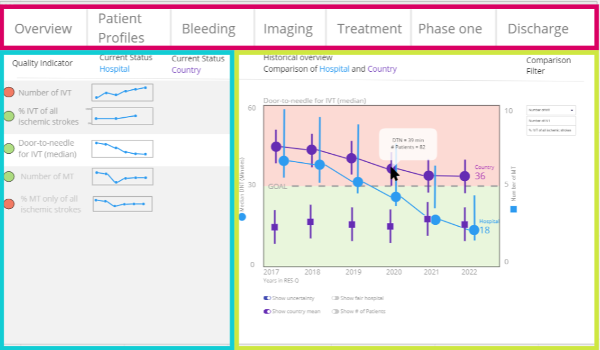
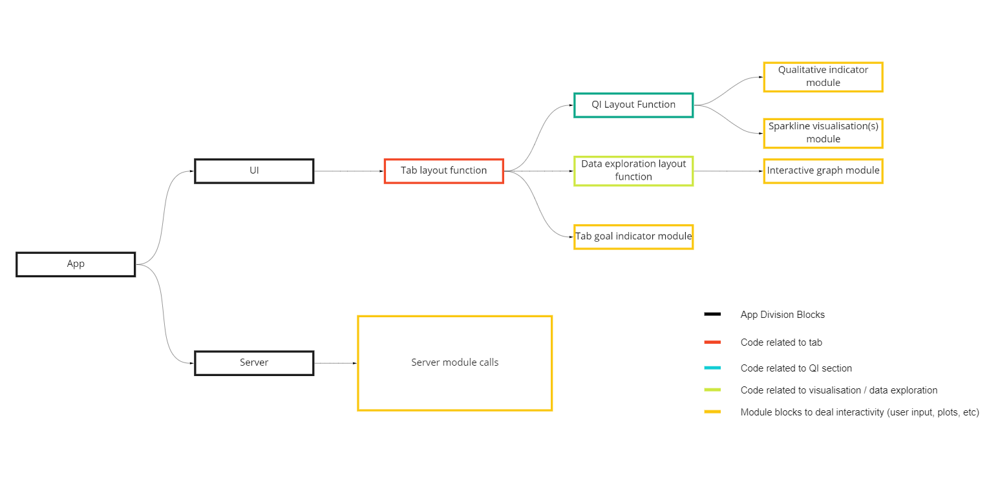

Dashboard-exploration - 
This application started off as trying to get something similar to

The current code architecture for such an app would look like:

This then developed into the following dashboard where the ui and functionality became more similar to the concept goal, but still ways to go.

When adding a hierarchical structure and logging capabilities the app starts looking like this:

