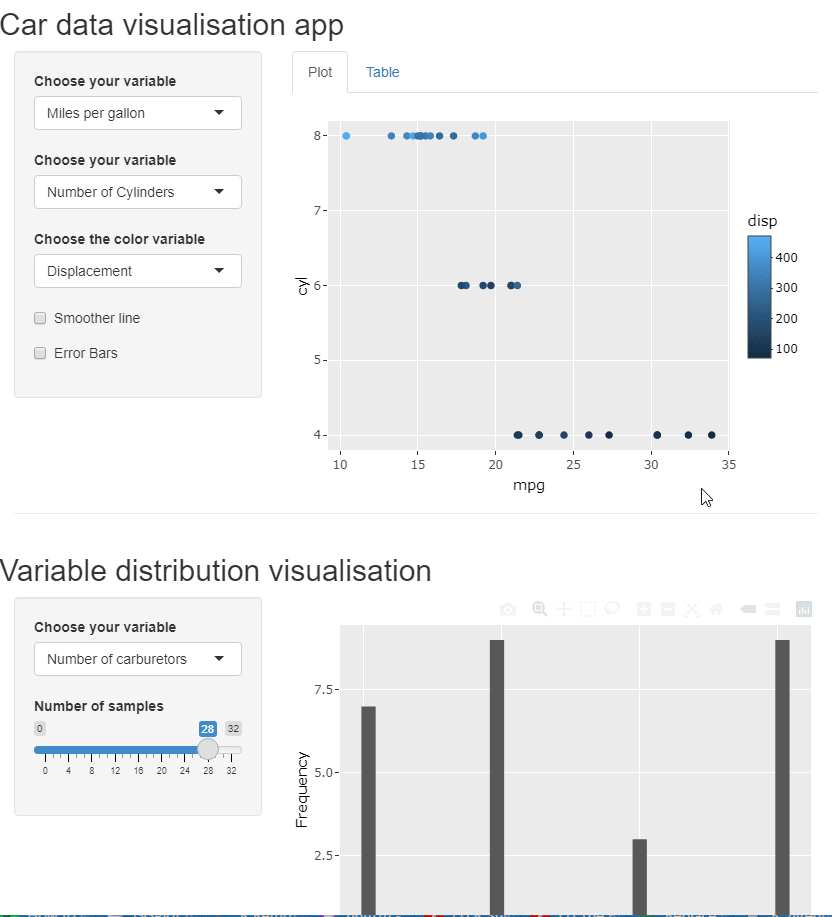
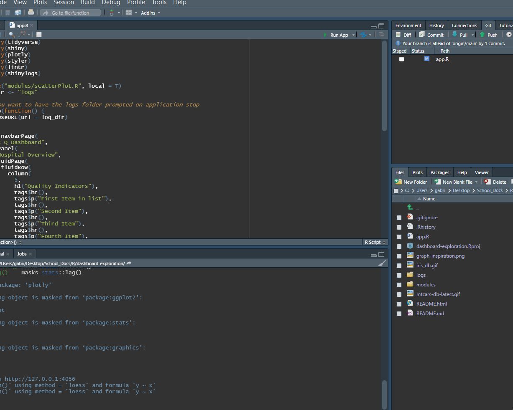

#dashboard-exploration
This application started off as trying to get something similar to

I started learning about shiny ui/server interactivity with the iris database. This was my first attempt:

This then developed into the following dashboard where the ui and functionality became more similar to the concept goal, but still ways to go.

When adding a hierarchical structure and logging capabilities the app starts looking like this:

