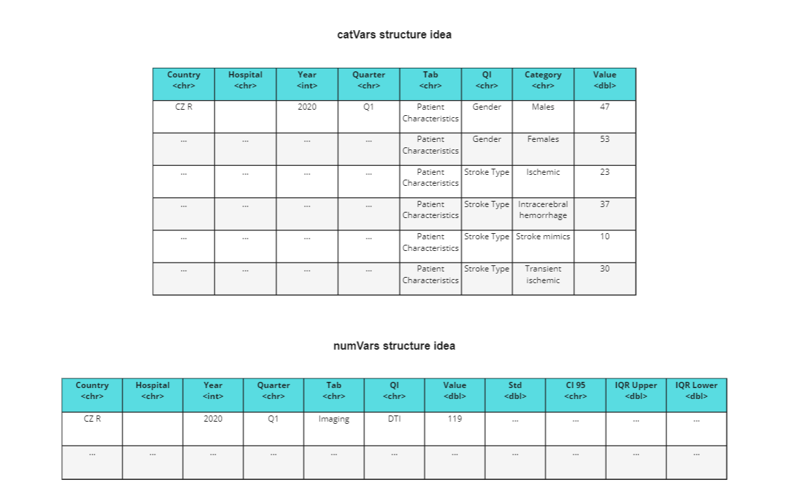
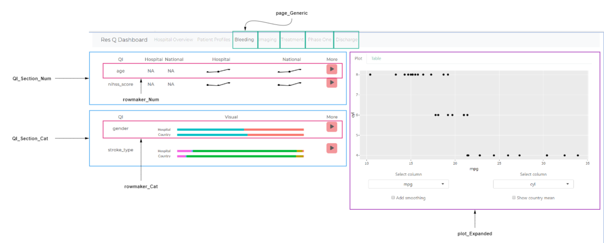
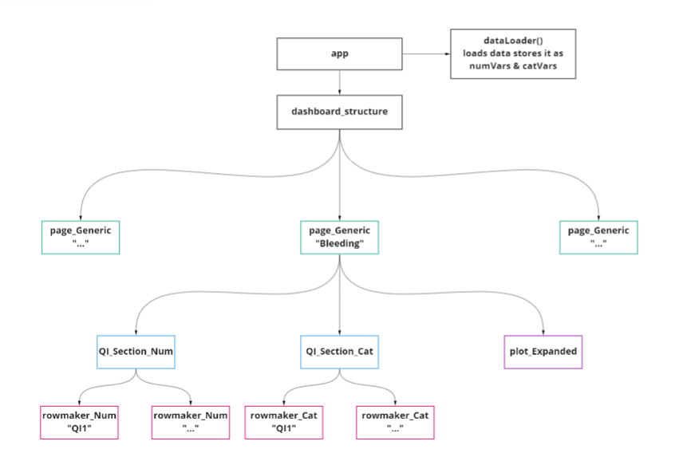

#title Dashboard-exploration - 
dashboard-exploration is a skeleton structure for a medical dashboard that will display stroke related quality indicators.

The goal is to take the hospital data and process it to the point that it looks as following for indicator display purposes:

When including the hospital data and visualising some QI's from it, the dashboard begins taking shape:

The current dashboard modular architecture is as following:

