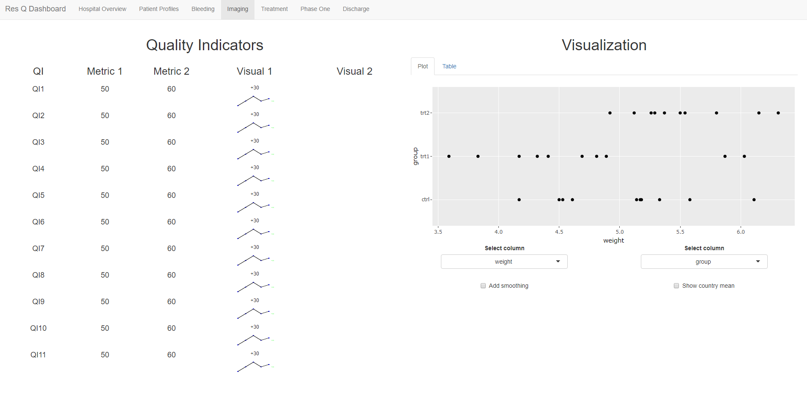

#title Dashboard-exploration - 
This application started off as trying to get something similar to

When adding a hierarchical structure and logging capabilities the app starts looking like this:

When adding some placeholder QI with metrics and visualizations it looks like:

The goal is to take the hospital data and process it to the point that it looks as following for indicator display purposes:

When including the hospital data and visualising some QI's from it, the dashboard begins to look similar to the target:

To get to this goal a modular restructuring had to be done for the code and now the architecture looks as following:

