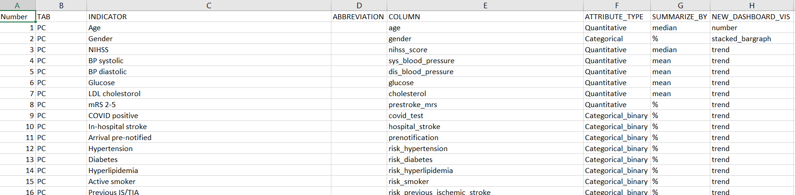

The dashboard's goal is to present a quick overview over a large number of stroke quality care data for clincians.
This includes numeric and categorical parameters. To get to this goal a modular restructuring had to be done for the code and now the architecture looks as following:

Notice how the annotated screenshot and the architecture tie together:

1 - For students or future developers wishing to change the visuals, you want to tinker with the modules rowmaker_Num & rowmaker_Cat. These two functions are the ones rendering the plots, if you want to alter how the plots look then focus on the output$vis as this is where the plot is generated. Should there be a to change how the imported data is handled, this must be done in the dataHandlerQI.R file. This is the function the rowmaker modules call to retrieve the data needed to plot the graphs.

2 - If we want to expand on the dashboard, we can do so by editting on the QI_Info excel sheet (for adding more QI's) or edit the dashboard_structure, page_Generic & page_PC/HO if ideas come about regarding how these should look and what functionalities they have.

The current dashboard applications looks like and has the functionality shown by the following:

It generates these plots and metrics by loading from sample anonymised hospital data. The anynomised hospital data is called dataREanonymized - ask Hendrik or Mathias for permission for this file (in csv format), it cannot be uploaded here as it contains sensitive hospital data. If we want to change how the data is imported, look at the function called dataLoader under the utils folder.

This hospital data has properties which can be found in [here](https://docs.google.com/spreadsheets/d/1MrhG4S0lIzMI6-J7iiURH5LDJ0fAl3RoqFwqMTxXiCY/edit#gid=2086406418) under the data columns category, there you can see for each column how much missing data there is and what type of data each column has (categorical or numeric).

Furthermore it makes use of the QI_Info to load certain QI's with their corresponding visualisations, abbreviations and the column the QI needs to extract the information from. Note the dashboard does not currently load the patient characteristics or hospital overview as these tabs are likely to look completely different than the others.

Should we want to add more QI's we can simply add an entree to the QI_Info excel sheet with specific visualisation, abbreviation, indicator name and column name from which it must be constructed it will do so automatically (With the exception of patient characteristics and hospital overview).

